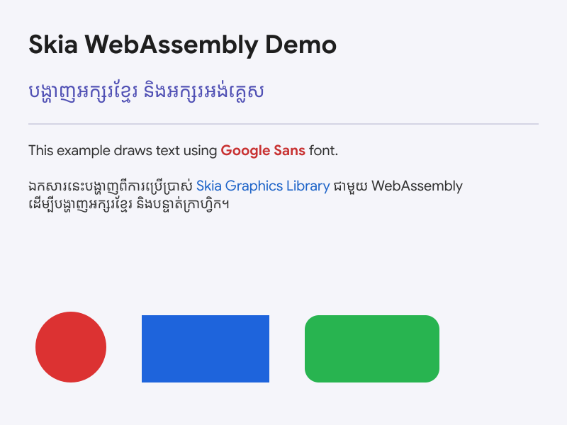

# Skia for Web

WebAssembly bindings for the [Skia](https://skia.org) graphics library. Designed for image or document generation — export to PDF, SVG, and PNG with full text layout and custom font support.



<sub>Generated by <a href="examples/node/index.js">examples/node/index.js</a></sub>

- No GPU (CPU-only, keeps the binary small)
- No browser Canvas API emulation
- No system fonts — all fonts must be loaded manually
- Works in Node.js and browsers

## Install

```sh
npm install skia
```

## Usage

```js
import { create } from 'skia';

const CanvasKit = await create();
```

For browsers, import from the browser entry point:

```js
import { create } from 'skia/browser';

const CanvasKit = await create();
```

### Export to PDF, SVG, and PNG

Use `PictureRecorder` to record drawing commands once and replay them into multiple output formats.

```js
import fs from 'node:fs/promises';
import { create } from 'skia';

const CanvasKit = await create();

const fontData = await fs.readFile('MyFont.ttf');
const fontMgr = CanvasKit.FontMgr.FromData(fontData);

// Record drawing commands
const recorder = new CanvasKit.PictureRecorder();
const canvas = recorder.beginRecording(CanvasKit.LTRBRect(0, 0, 800, 800));

const builder = CanvasKit.ParagraphBuilder.Make(
  new CanvasKit.ParagraphStyle({
    textStyle: { color: CanvasKit.BLACK, fontSize: 24, fontFamilies: ['My Font'] },
  }),
  fontMgr
);
builder.addText('Hello, world!');

const paragraph = builder.build();
paragraph.layout(700);
canvas.drawParagraph(paragraph, 50, 100);

const picture = recorder.finishRecordingAsPicture();

// PDF
const doc = new CanvasKit.PDFDocument(new CanvasKit.PDFMetadata());
doc.beginPage(800, 800).drawPicture(picture);
doc.endPage();
await fs.writeFile('output.pdf', doc.close());

// SVG
const svg = new CanvasKit.SVGCanvas(800, 800, 1);
svg.getCanvas().drawPicture(picture);
await fs.writeFile('output.svg', svg.close());

// PNG
const surface = CanvasKit.MakeSurface(800, 800);
surface.getCanvas().drawPicture(picture);
await fs.writeFile('output.png', surface.makeImageSnapshot().encodeToBytes());

// Free WASM memory
paragraph.delete();
builder.delete();
fontMgr.delete();
picture.delete();
recorder.delete();
surface.delete();
```

## Memory management

All CanvasKit objects must be manually freed by calling `.delete()` when no longer needed. Failing to do so leaks WASM memory.

## License

Apache-2.0
